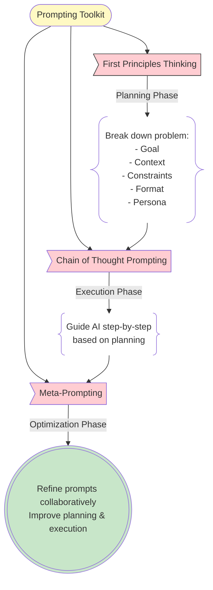

!!! tip ""
    > "The first principle is that you must not fool yourself—and you are the easiest person to fool." _Richard Feynman_ (Caltech commencement speech, 1974).

## Chapter 4: Exploring Meta-prompting – Letting AI Help You Prompt Better

You've mastered crafting detailed prompts (First Principles) and guiding AI through steps (Chain of Thought). Now, let's explore a concept that truly elevates your AI interaction to a collaborative partnership: **Meta-prompting**.

### 4.1 What is Meta-prompting, and Why is it so Powerful?

Imagine having a "prompt coach" or a "strategy consultant" built right into Cortex. Instead of just asking Cortex to complete a task, Alex is asking it to help figure out the _best way to ask for that task_. This is the core of meta-prompting.

**The Power of "Thinking about Thinking"**

Meta-prompting is powerful because you are asking the AI to "think about thinking." You're not just asking it to perform a task; you're asking it to analyze the task itself and tell you what it needs to perform it well. This is a subtle but profound shift in how you interact with AI.

By using meta-prompting, you are tapping into the AI's own understanding of language, logic, and problem-solving. You are essentially asking it to be your co-pilot in the truest sense, not just executing your commands, but helping you formulate better commands.

**Meta-prompting means Alex is using Cortex to:**

- **Brainstorm prompt ideas:** "What information would you need to create an engaging social media post about `[topic]` that targets `[specific audience]`?"
- **Refine existing prompts:** "I tried this prompt: `[My current prompt]`. The output wasn't quite right. What specific details or instructions should I add to improve it to achieve `[desired outcome]`?"
- **Identify missing elements:** "I want to create a `[type of document/content]`, e.g., a short internal report. What are the crucial pieces of information or sections I should include in my prompt to make sure you generate a comprehensive and useful result?"
- **Suggest optimal formats or personas:** "For a presentation summary aimed at senior management, what `tone` or `structure` would be most effective for you to adopt?"

Essentially, Alex is tapping into Cortex's vast knowledge of text generation, understanding, and even its own operational logic to make _Alex's own_ prompting more effective. It's a powerful feedback loop.

**A Real-World Analogy**

Imagine Alex wants to build a new, innovative type of raised garden bed. Instead of just asking a master carpenter, "Can you build this for me?", Alex would get a much better result by asking, "I want to build a raised garden bed with these specific features. What information, measurements, and materials do you need from me to create the best possible design?"

In this analogy:

- **Alex** is the user.
- The **master carpenter** is the AI (Cortex).
- The **request for the best way to provide information** is the meta-prompt.

By asking the expert (the carpenter) what they need, Alex is ensuring that the final product is exactly what they envisioned. This is the same principle as meta-prompting.

### 4.2 Practical Example: Using Meta-prompting for Workshop Promotional Content

Remember how Alex is organizing the "Beginner's Urban Gardening Workshop"? Alex needs to create various promotional materials – social media posts, email announcements, flyer bullet points. While Alex could write individual prompts for each, Meta-prompting can help design one super-prompt that handles most, or even all, of it accurately.

Here's how Alex would use Meta-prompting to create a more comprehensive prompt for that task:

!!! question "Alex asks Cortex (The Meta-Prompt)"

    I need to create a single, comprehensive prompt for generating promotional content for my "Beginner's Urban Gardening Workshop." This prompt should instruct you to take workshop details and generate different types of promotional text: short social media posts, a longer email announcement, and concise flyer bullet points.

    The content should always be encouraging, beginner-friendly, and highlight the benefits of urban gardening. It should also include a call to action to sign up for the workshop.

    Think step-by-step about what instructions and constraints you would need to perform this task accurately and consistently in one go. What's the best way to structure this single prompt to ensure versatile and effective promotional content every time? Please provide the optimized prompt.

!!! quote "Cortex's Suggested Optimized Prompt (answer from ChatGPT)"

    To generate high-quality, multi-format promotional content consistently from a single prompt, you need to structure it so that it:

    1. Defines the objective clearly – Promote a specific event.
    2. Lists all necessary input details – Date, time, location, audience, benefits, cost, etc.
    3. Specifies the content formats required – e.g., short social posts, email, flyer copy.
    4. Describes tone and style – Encouraging, beginner-friendly, benefit-focused.
    5. Includes constraints – Character limits, call to action, avoid jargon, etc.
    6. Gives clear formatting instructions – So outputs are easy to use directly.

    Here’s an optimized single prompt you can reuse or adapt as needed:

    ⸻

    📢 Optimized Prompt for Generating Promotional Content

    You are a marketing copywriter creating promotional content for a “Beginner’s Urban Gardening Workshop.” Using the details provided below, generate three types of content:

    1. Three short social media posts (max 280 characters each) – Tone: upbeat, beginner-friendly, benefit-focused. Include emojis and hashtags where appropriate. End with a clear call to action (e.g., “Sign up now!”).
    2. One engaging email announcement (150–200 words) – Tone: welcoming, informative, and encouraging for beginners. Highlight the benefits of urban gardening, what attendees will learn, and why it’s a great opportunity. End with a strong call to action and sign-up link placeholder.
    3. Concise flyer bullet points (5–7 total) – Straight to the point. Use benefit-driven bullets, covering what the workshop includes and who it’s for. Include location, date/time, and a call to action to register.

    Workshop Details (to be provided by user):

    - Workshop title:
    - Date and time:
    - Location (physical or online):
    - Who it’s for (e.g., beginners, apartment dwellers):
    - What participants will learn:
    - Key benefits of urban gardening (e.g., fresh herbs, sustainability, stress relief):
    - Cost (if any):
    - Registration link or sign-up instructions:
    - Any extra info (e.g., bring-your-own materials, limited spots, etc.):

    Constraints:

    - Use clear, simple language with no jargon.
    - Always emphasize it’s beginner-friendly.
    - Highlight urban gardening benefits throughout.
    - Include a call to action in each content format.
    - Maintain a consistent and inviting tone.

    ⸻

    Let me know if you’d like this turned into a fillable template or made more concise.

**The Power of This Optimized Prompt:**

Now, Alex can use this single, powerful prompt. By simply pasting the workshop details into the proposed template `Workshop title`, `Date and time`, `Location`, etc, Cortex has helped Alex create a highly robust, self-contained instruction set that can perform the entire complex content generation in one go, dramatically speeding up Alex's workflow!

This demonstrates how **Meta-prompting** empowers us to not just use the AI, but to collaborate _with_ AI to become a better, more efficient user. It's truly a leap from "command-based" interaction to a sophisticated "copilot" level.

### 4.3 Tying it All Together: The Prompting Power Trio

Think of the three techniques you've learned as a powerful toolkit for any task:

1. **First Principles Thinking:** This is your **planning** phase. You break down your problem into its fundamental components (goal, context, constraints, format) to understand what you need to ask.
2. **Chain of Thought Prompting:** This is your **execution** phase. You guide the AI through the steps you identified in your planning phase, ensuring a logical and accurate process.
3. **Meta-Prompting:** This is your **optimization** phase. You collaborate with the AI to refine your prompts, making your planning and execution even more effective. It's how you turn a good prompt into a great one.

!!! Tip " "
    > “Master this trio, you must. Face any challenge with confidence, you will. From mere tool to true partner in creation and problem-solving, the AI shall become.” **Yoda, Jedi Master**

    Well, actually chatGpt wrote this phrase for me in Yoda's style 😉
