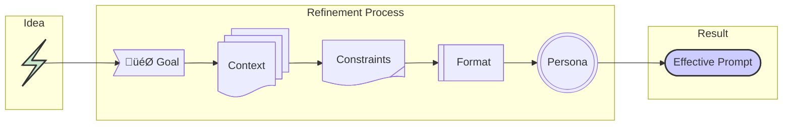

!!! tip ""
    > "The important thing is not to stop questioning. Curiosity has its own reason for existence." _Albert Einstein_ (LIFE Magazine, 1955)

This might sound like a fancy academic term, but "First Principles Thinking" is an incredibly powerful and practical approach that will transform how you write prompts. It's about getting to the root of your request before you even start typing.

## Breaking Down the Problem to its Core

Imagine Alex wants to grow a thriving vegetable garden. Instead of just looking at a beautiful garden and trying to copy its exact layout, First Principles Thinking means Alex goes back to the absolute basics. Alex thinks about: _What does a garden fundamentally need to thrive? Sunlight? Water? What kind of soil? What plants will grow best in this specific environment?_ Alex builds understanding from the ground up, based on core truths about gardening, rather than just copying or modifying existing designs.

Applying this to AI prompting means, instead of trying to find an existing prompt that might _sort of_ fit what you want, you ==break down your request to its most fundamental components==. You ask yourself:

1. What is my ultimate goal, precisely? (Not just "summarize this," but "summarize this **so that** a busy executive can grasp its implications in under 30 seconds.")
2. What **essential** information does Cortex _absolutely need_ to achieve that goal accurately?
3. What are the critical boundaries, limitations, or rules Cortex _must_ adhere to?
4. What specific format or style do I expect the output to be in?

By thinking this way _before_ Alex even starts writing the prompt, Alex ensures Cortex receives exactly what it needs, avoiding vague instructions that lead to generic or off-target responses. It's like a seasoned gardener meticulously planning a garden layout, considering every plant's needs and the available space, before putting the first seed in the ground.

## Key Components of an Effective Prompt

When you apply First Principles Thinking, you'll naturally identify these essential ingredients that go into a truly robust prompt. Think of these components as giving Cortex a very clear recipe, not just a vague idea.

---

### Goal or Task

> What exactly do you want Cortex to _do_?

This is the most crucial part. Be specific, actionable, and outcome-oriented.

!!! quote "Poor Goal: Too broad, will get generic info."
    "Tell me about gardening."

    ??? failure "Answer from ChatGPT ..."

        Gardening is the practice of growing and cultivating plants as part of horticulture. It can range from growing ornamental plants for their flowers and foliage to cultivating vegetables, fruits, herbs, and other edible plants. Whether you have a sprawling backyard or just a few containers on a balcony, gardening can be tailored to any space.

        Types of Gardening

        1. Home Gardening: Small-scale, personal gardening typically done in yards or on balconies.
        2. Container Gardening: Growing plants in containers—great for small spaces.
        3. Raised Bed Gardening: Uses elevated soil beds; improves drainage and soil quality.
        4. Hydroponic Gardening: Growing plants in nutrient-rich water without soil.
        5. Indoor Gardening: Growing houseplants, herbs, or small edibles inside.
        6. Permaculture: A sustainable approach that mimics natural ecosystems.

        Benefits of Gardening

        - Physical activity: It’s a light workout and good for mobility.
        - Mental health: Reduces stress, boosts mood, and fosters mindfulness.
        - Sustainability: Growing your own food reduces reliance on commercial agriculture.
        - Education: Teaches patience, biology, and responsibility.

        Basic Tips to Get Started

        1. Choose your location wisely – Most vegetables and flowers need 6–8 hours of sunlight.
        2. Start with good soil – Soil health is crucial. Consider composting to enrich it.
        3. Pick easy plants – Start with low-maintenance plants like basil, mint, lettuce, or marigolds.
        4.  Water wisely – Overwatering is as harmful as underwatering. Learn what your plants need.
        5.  Mulch – Helps retain moisture, suppress weeds, and regulate soil temperature.

        Common Tools

        - Trowel, pruning shears, garden gloves, watering can/hose, spade, rake

        Would you like advice tailored to your space, climate, or goals (e.g., growing food vs. ornamentals)?

!!! quote "Better Goal: Specific action, format, and audience."
    "Generate a list of frequently asked questions by new gardeners about starting a small urban vegetable patch, along with concise, easy-to-understand answers for a workshop handout."

    ??? success "Answer from ChatGPT ..."

        Here’s a list of frequently asked questions (FAQs) for new gardeners starting a small urban vegetable patch, along with clear, concise answers—ideal for a workshop handout:

        üå± Urban Vegetable Gardening: FAQ for Beginners

          **1 What vegetables are easiest to grow for beginners?**

          Start with easy, fast-growing plants like lettuce, spinach, radishes, green beans, cherry tomatoes, and herbs (basil, mint, parsley).

          **2 How much space do I need?**

          You can start with as little as a few square feet—even containers on a balcony or windowsill work. Use vertical space for vining plants like cucumbers or beans.

          **3 What kind of soil should I use?**

          Use a high-quality potting mix or vegetable garden soil. For containers, avoid garden soil—it’s too dense and drains poorly.

          **4 How much sunlight do vegetables need?**

          Most vegetables need at least 6 hours of direct sunlight per day. Leafy greens can tolerate some shade.

          **5 How often should I water my plants?**

          Water when the top 1 inch of soil feels dry. In hot weather, this may mean watering daily, especially for containers.

          **6 Can I grow vegetables in containers?**

          Yes! Just make sure your containers are at least 8–12 inches deep and have drainage holes.

          **7 What should I do about pests?**

          Inspect plants regularly. Use natural solutions like neem oil, insecticidal soap, or companion planting (e.g., marigolds to deter aphids).

          **8 Do I need to use fertilizer?**

          Yes, especially in containers. Use an organic vegetable fertilizer every 2–4 weeks or mix compost into your soil.

          **9 How long before I can harvest?**

          This varies by plant. Leafy greens like lettuce can be ready in 30 days, while tomatoes may take 60–80 days.

          **10 What if I don’t have a yard?**

          No problem! Try container gardening, vertical gardening, or a community garden plot.

          **11 When should I plant?**

          In most regions, start planting in spring after the last frost. Use seed packets or local planting calendars for guidance.

          **12 How do I know when to harvest?**

          Follow seed packet instructions. Generally, harvest when the vegetables look full-sized and healthy—don’t wait too long, or they may become bitter or tough.

        ⸻

        Would you like this formatted as a printable handout or in a slide deck style for your workshop?

---

### Context

> What background information does Cortex need?

Provide all relevant details, data, prior conversations, or specific scenarios that help Cortex understand your request properly. The more context you provide, the better Cortex can respond—just keep it brief and focused, as irrelevant details can create noise and reduce the quality of the results.

Example: Alex needs to analyze the feedback from last year's gardening workshop. Alex's goal is to identify common challenges new gardeners faced, particularly focusing on issues related to soil and sunlight, to help plan this year's workshop content.

The prompt:

> You are helping to plan this year’s gardening workshop. Below is feedback from people who attended last year’s session.
>
> Your goal is to find out what common problems new gardeners experienced — especially problems related to soil quality (like drainage or soil type) and sunlight (like too much shade or not enough sun).
>
> Read through the comments and summarize the main challenges that came up. Focus on patterns or issues that were mentioned by more than one person or seem important to address in future workshops. Present your findings as a short list of key points.
>
> Feedback:
>
> - “The workshop was very informative! I finally understand how to test my soil’s pH.”
> - “I loved the hands-on activities, but I wish there had been more discussion on dealing with heavy clay soil.”
> - “Great session overall. However, most of my yard is in the shade, and I still don’t know what to plant there.”
> - “The instructors were friendly and helpful. I feel more confident starting my vegetable garden now!”
> - “I didn’t realize how much poor drainage affects my plants. That tip alone was worth attending.”
> - “The workshop focused too much on raised beds. I wanted more advice for those of us with limited space or poor soil.”
> - “Really appreciated the sunlight-mapping exercise — I had no idea my garden wasn’t getting full sun like I thought.”
> - “It was a bit basic for me, but I could see it being super helpful for true beginners.”
> - “I struggled to follow the soil amendment section — it could use clearer examples or visuals.”
> - “My tomatoes actually thrived this year, thanks to the composting tips I picked up here!”

??? success "Answer from ChatGPT ..."
    Key Challenges for New Gardeners (Based on Workshop Feedback)

    **1 Soil Issues**

    - Heavy clay soil was a common concern, with participants wanting more guidance on how to manage it.
    - Poor drainage emerged as a key problem that affects plant health, with attendees valuing the tips provided.
    - Soil amendment guidance lacked clarity for some, especially beginners, who needed more examples or visuals to understand how to improve soil quality.
    - Limited or poor soil conditions were mentioned, particularly in relation to needing more options beyond raised bed gardening.

    **2 Sunlight Challenges**
    - Shaded yards were a significant issue, with attendees unsure of what plants thrive in low-light conditions.
    - Misjudging sun exposure was common; tools like sunlight mapping were helpful, but there’s still a need for more support on adapting garden plans based on actual light conditions.

    **Recommendations for Future Workshops**

    - Include targeted advice on managing heavy clay and poorly draining soils.
    - Offer clearer instruction on soil amendments using step-by-step visuals or demonstrations.
    - Expand content on gardening in shaded areas and choosing appropriate plants.
    - Continue and possibly expand practical tools like sunlight mapping to help gardeners assess their growing conditions accurately.

!!! quote "Good context"

    **The timeframe**: _“…people who attended last year’s session.”_. This clearly refers to feedback from the previous year, which frames the temporal context.

    **Data source**: A list of direct quotes from attendee feedback.

    **Specific focus**: Explicit and narrow scope, the soil and sunlight-related challenges. _“Find out what common problems new gardeners experienced — especially problems related to soil quality (like drainage or soil type) and sunlight (like too much shade or not enough sun).”_

    **Desired analysis provide context**: The prompt asks for "A summary of main challenges, with attention to patterns, repetition, or important issues that should be addressed in future workshops".

---

### Constraints/Rules

> What boundaries, limitations, or specific instructions must Cortex follow?

These are the guardrails. This includes what _not_ to do, length limits, factual requirements, specific terminology to use (or avoid), or even ethical considerations. This is also where you set "rules Cortex must follow."

You could expand the previous prompt and add:

!!! abstract "Rules you must follow"
    - Summary should be no more than 5 bullet points.
    - Keep each point concise — no more than 2 sentences.

Assuming Alex is asking Cortex to help organizing the this year's workshop, you could also try to incorporate this next example:

> "The workshop agenda must be no more than 90 minutes. Do not include any topics requiring specialized tools or large plots of land. Ensure it focuses only on organic methods. All plant recommendations must be suitable for container gardening."

---

### Format

> How do you want Cortex's output to be structured?

Do you need a list, a paragraph, a table, a specific tone, or markdown formatting? Clearly specify the desired structure.

!!! example  "Results format request"
    Present the information as a step-by-step guide for planting seeds.

    Use an encouraging and positive tone.

    Conclude with a single sentence about the joy of harvesting.

This dictates the structure and tone precisely.

---

### Persona

> Should Cortex adopt a specific role or character?

Assigning a persona can significantly influence the **style**, **tone**, and **perspective** of the output, making it more tailored to your needs.

This is optional but powerful.

!!! example "Defining a role/persona"
    - Act as a **seasoned organic gardener** with a passion for teaching beginners. Explain the basics of choosing the right plants for a small urban patch to a first-time urban gardener.
    - As an experienced **community garden manager**, outline the critical success factors for basic container care.

---

## Activity: Deconstructing a Prompt

!!! quote ""
    Let’s practice identifying these components.

Read the following prompt and break it down into its core components we just saw.

Prompt: _"Alex wants Cortex to act as an experienced urban farming consultant. Alex is planning a 2-hour workshop session on 'Container Gardening Basics' for a community garden group. The session budget for materials is $50. Recommend practical, low-cost methods for starting and maintaining a small urban vegetable patch, focusing on plant selection and basic care. Do not include advanced hydroponics. Present the session outline as a timed agenda in a table, including estimated material costs per activity and suggest one kid-friendly demonstration."_

---

Your Turn! Identify these elements:

- Goal:
- Context:
- Constraints/Rules:
- Format:
- Persona:

??? success "Answer"

    - Goal: Recommend practical, low-cost methods for starting and maintaining a small urban vegetable patch, focusing on plant selection and basic care.
    - Context: Alex is preparing a 2-hour workshop on “Container Gardening Basics” for a community garden group.
    - Constraints/Rules:
        - Budget for materials is $50
        - Do not include advanced hydroponics
        - Include one kid-friendly demonstration
    - Format: A timed agenda presented in a table, including estimated material costs per activity.
    - Persona: An experienced urban farming consultant (Cortex is to act as this persona).

---

How would you change this prompt to make it to your liking? Apply the change and run the prompt üòå

!!! tip
    Built the prompt up from what would be a simple search query. Execute each partial prompt and compare the result you get with the previous step.
